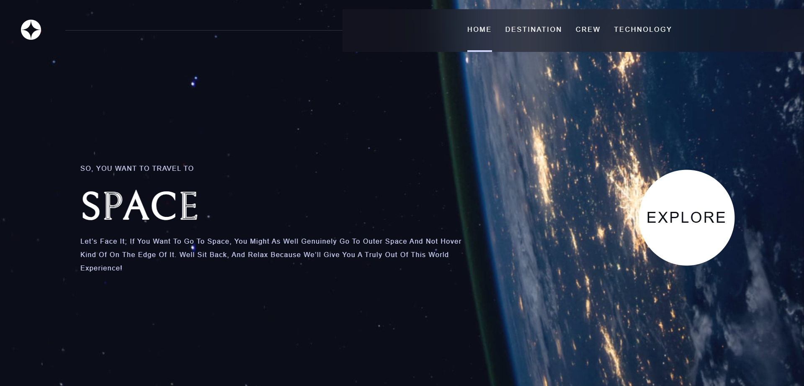
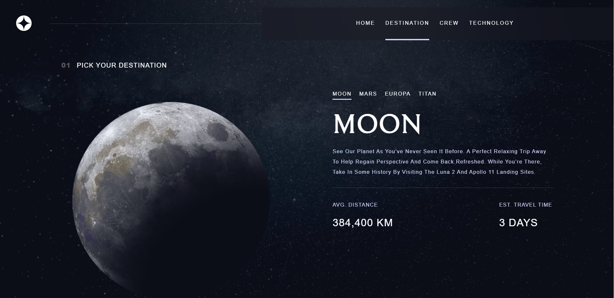
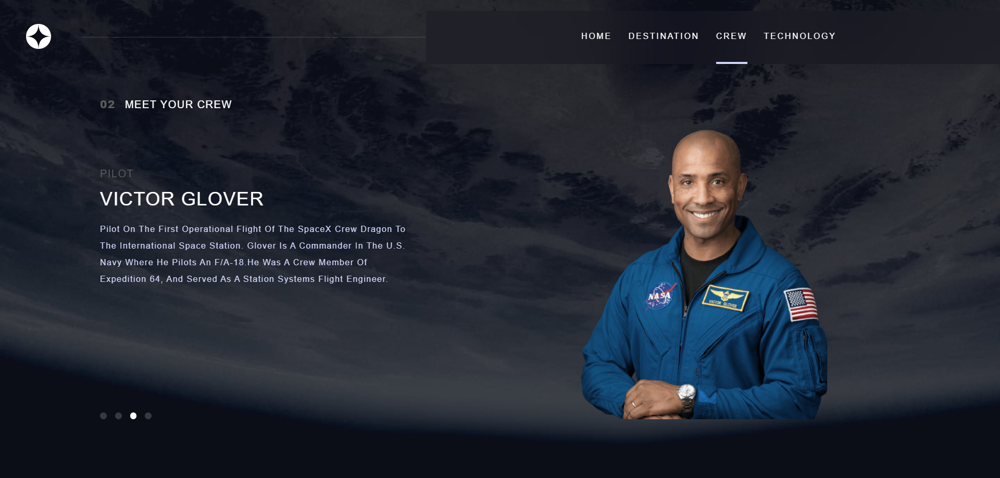
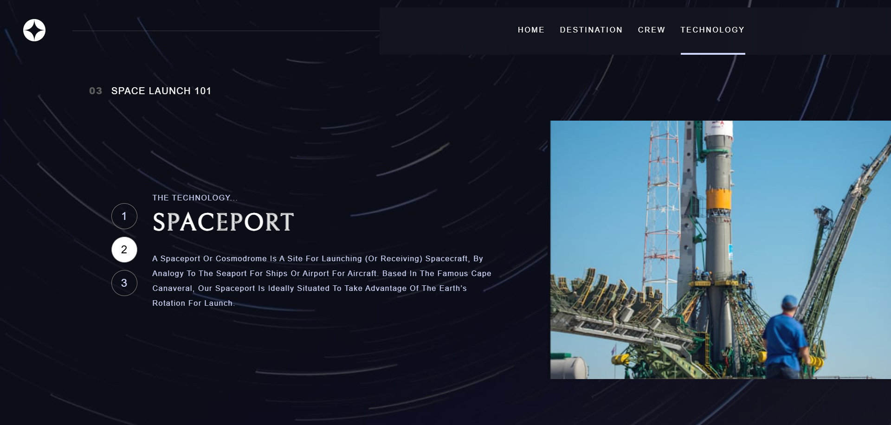

# Space Exploration Website

This project is a collaborative challenge from [Frontend Mentor](https://spacetourism-seven.vercel.app/), [Scrimba](), and Kevin Powell, designed to enhance and test my skills in React and frontend development. The website allows users to explore different planets in space, showcasing various technologies and crew members involved in the mission. It features an engaging and interactive UI, with seamless navigation and dynamic content to create an exciting experience. This project not only strengthened my understanding of React but also honed my ability to Replicate UI/UX design and complex, responsive layouts and implement advanced frontend features.

## Tech Stack

- React -> Frontend Framework for javascript
- useReducer and useContext -> State management
- css modules -> Scoped styling
- React router -> Routing between pages

## Assets and Resources

- Space Tourism project at frontend mentor [- link](https://www.frontendmentor.io/challenges/space-tourism-multipage-website-gRWj1URZ3)
- quick visit to the space tourism figma design file [- link](https://www.figma.com/design/fCiWPkxDaZaUE3txN6mWIX/space-tourism-website?node-id=0-1&node-type=canvas&t=klupQ5gE1osQvDt6-0)

## My APP
- **visit [My Cloned Application live](https://spacetourism-seven.vercel.app/)**
  

